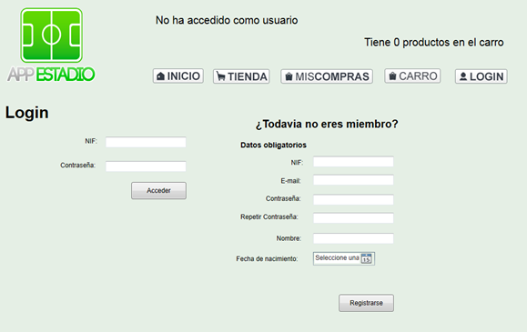
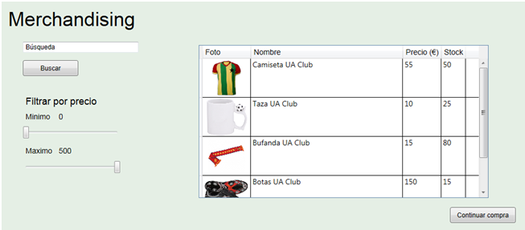
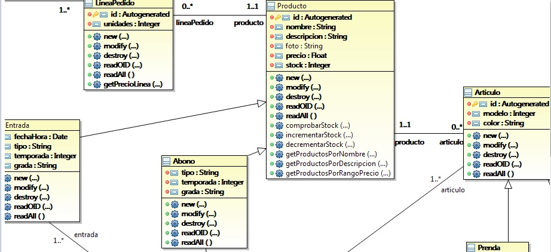

AppEstadio
==========
Aplicación para venta de entradas y merchandising en estadios. Orientada al uso en terminales de puntos de venta (TPV).
Realizada usando las tecnologías C#, WPF, OOH4RIA y el patrón arquitectonico Model-View-Presenter. 

